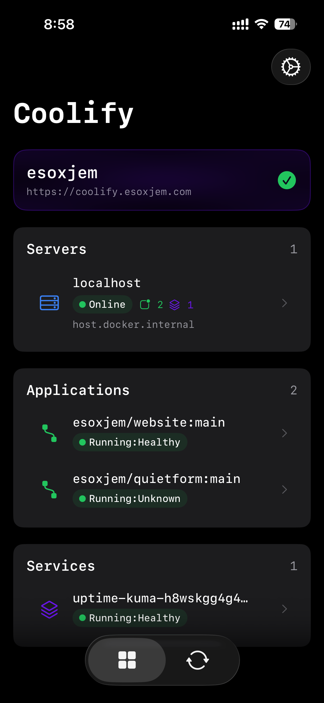
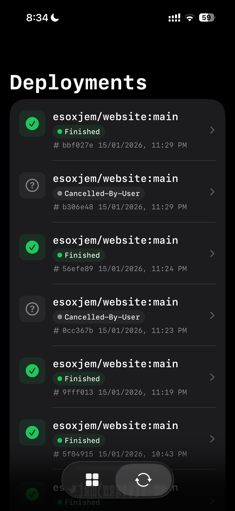
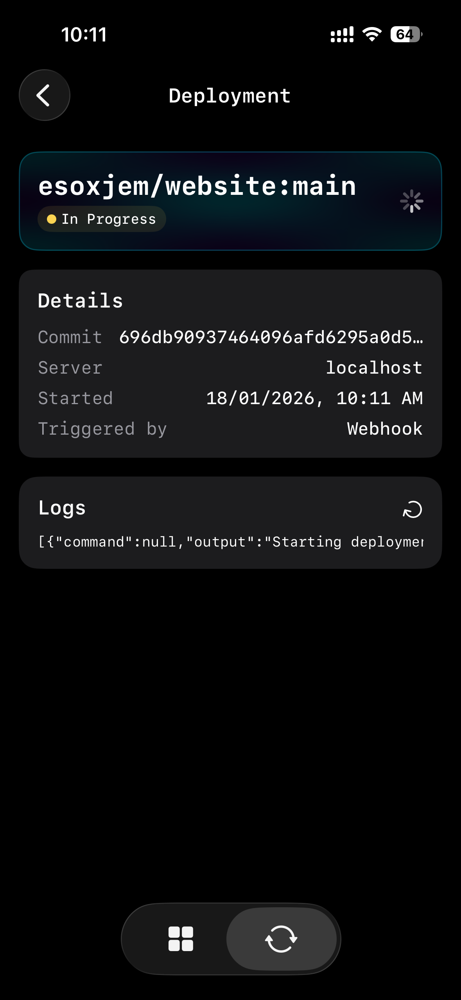
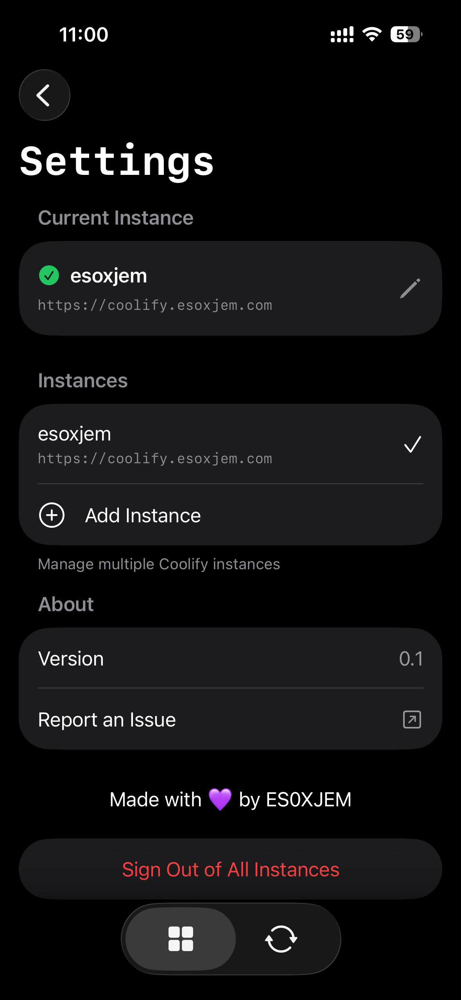

# Coolify for iOS

Manage your self-hosted Coolify instance the iOS app.

## Screenshots

  
  
  
  

## What is Coolify?

[Coolify](https://coolify.io) is an open-source, self-hostable alternative to platforms like Heroku, Netlify, and Vercel. It lets you deploy applications, databases, and services on your own servers with just a few clicks.

This iOS app gives you the power to monitor and manage your Coolify instance right from your iPhone.

## Getting Started

### Prerequisites
- An iPhone running iOS 26.0 or later
- A running Coolify instance (v4 or later)
- An API token from your Coolify instance

### How to Connect

1. **Get your API Token**
   - Log into your Coolify web dashboard
   - Go to **Settings** → **API Tokens**
   - Create a new token with appropriate permissions
   - Copy the token (you'll only see it once!)

2. **Add Your Instance**
   - Open the Coolify iOS app
   - Tap **Get Started**
   - Enter a name for your instance (e.g., "Production Server")
   - Enter your Coolify URL (e.g., `https://coolify.example.com`)
   - Paste your API token
   - Tap **Connect**

3. **Start Managing!**
   - Once connected, you'll see your Dashboard
   - Use the tab bar to navigate between features
   - Pull down on any screen to refresh data

## Settings & Preferences

Access Settings from the tab bar to:
- View your current connected instance
- Switch between multiple instances
- Add new Coolify instances
- Set auto-refresh intervals (15s, 30s, 1min, 5min)
- Access Coolify documentation
- Sign out and remove all stored credentials

## Security

- All API tokens are stored securely in the iOS Keychain
- Connections to your Coolify instance use HTTPS
- No data is stored on external servers—the app connects directly to your instance

## Requirements

| Requirement | Version |
|-------------|---------|
| iOS | 26.0+ |
| Coolify | v4+ |

## Support

- **Coolify Documentation**: [coolify.io/docs](https://coolify.io/docs)
- **Coolify GitHub**: [github.com/coollabsio/coolify](https://github.com/coollabsio/coolify)
- **Follow Development Updates**: [@ES0XJEM on X](https://x.com/ES0XJEM)

## License

This project is open source. See the LICENSE file for details.
